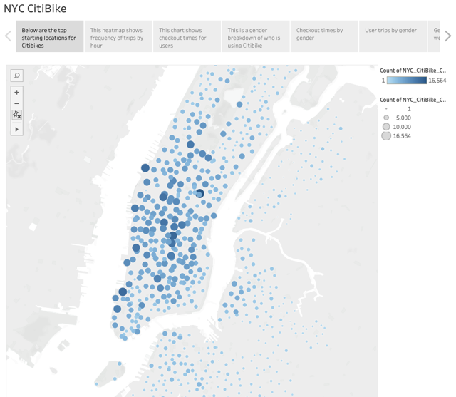
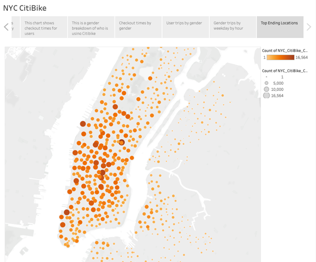
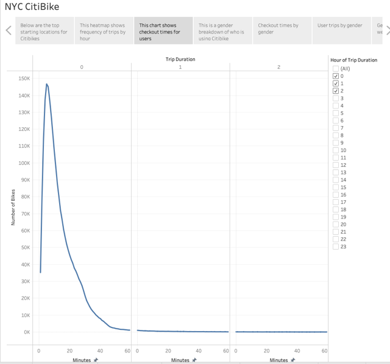
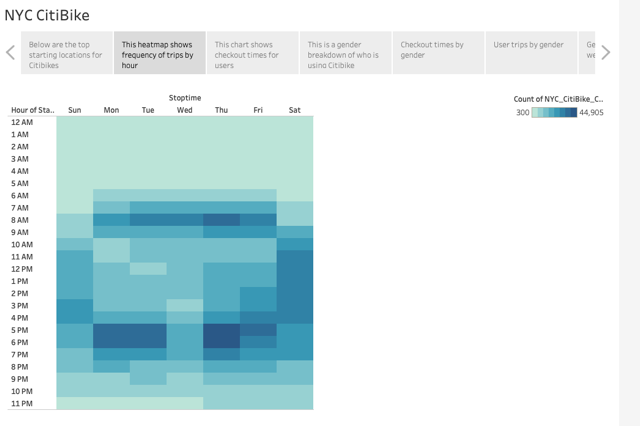
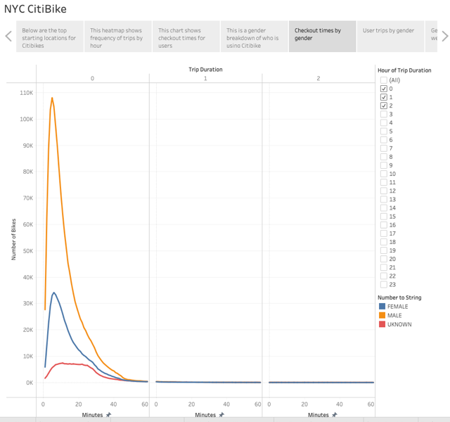
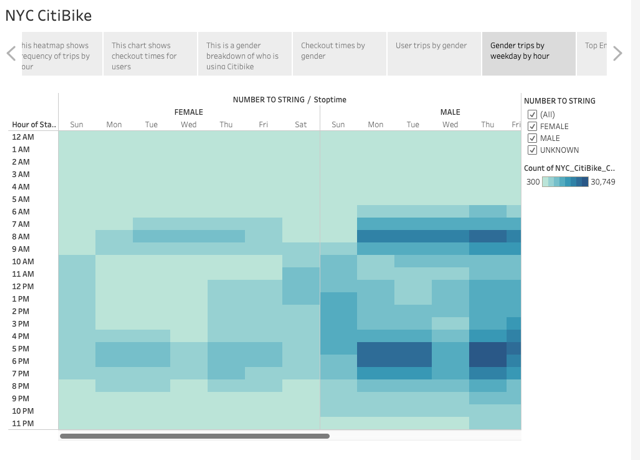
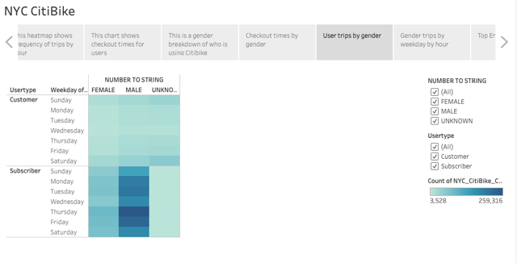

# Bikesharing

# Overview of the Analysis:

* More work needs to be done to convince investors that a bike-sharing program in Des Moines is a solid business proposal. To solidify the proposal, one of the key stakeholders would like to see a bike trip analysis.

* For this analysis, I used Pandas to change the "tripduration" column from an integer to a datetime datatype. Then, using the converted datatype, I created a set of visualizations to:

1. Show the length of time that bikes are checked out for all riders and genders
2. Show the number of bike trips for all riders and genders for each hour of each day of the week
3. Show the number of bike trips for each type of user and gender for each day of the week.
4. Create a story to present the final analysis to pitch to investors.

# Results

Tableau Results [Click Here](https://public.tableau.com/app/profile/vincent.r.vinci/viz/NYCCitibike_16577658698610/NYCCitiBike?publish=yes)

 

* The first visual shows where the highest concentration of bike rentals start. The larger the circle size and the darker the color, the higher the number of bike shares that began in that area. 

 

* The ending location of bike trips are shown above. The circles again represent the number of bikes that ended in that location by larger size and darker red color. After looking at both starting and ending locations one can recognize that the users are starting and ending their trips in roughly the same area.

 

* Above shows the duration of the bike trip in minutes. The majority of trips are under 20 minutes, and the most significant volume of trips was just 5 minutes long.

 

* The image is a heat map to show most active rider times. Weekends see the most use from 9 am to around 5-6 pm. The weekdays see most rider traffic during commuting hours of 7am-9am and 4pm-8pm. The bikes seem to be a popular commuting choice. 

 
 

* The visuals show the ride duration of users by gender, and the ride count per hour by gender. Males are the most common users of bikes. Users who have identified as male make up more than two-thirds of the total users. 

* This visual shows the breakdown of what user type of customer uses the bike share program on any day of the week. There two user types: subscribers and customer. Customers are usually listed as gender unknown while subscribers share their gender. For female subscribers, Wednesdays are the least popular day for using the bike share program. For male subscribers, Thursdays are the most popular day for the bike share program, but most days have high usage for male subscribers in general. Saturdays and Sundays are the highest bike use time for customers.

## Summary: 
* The are several takeaways from the Citi Bike Data from NYC as a model for the program.
1. Bike stations should be under 20 minutes away from each other in areas where there is already a lot of foot traffic—the starting and ending locations from NYC support this and the trip duration. 
1. A subscriber user model works well for a consistent bike share throughout the week before and after work hours. A non-subscriber option needs to be included for the customers who only use the program once as they visit the city. A higher number of bike shares will occur during the weekend for both user types. 
1. Individuals who identify as Male are likely to make up the subscriber base.
* Other visualizations that may be useful for further analysis include adding additional months to gauge a year-long business model. Additionally, more information related to the age of the user would be helpful to create a better customer profile for marketing.
